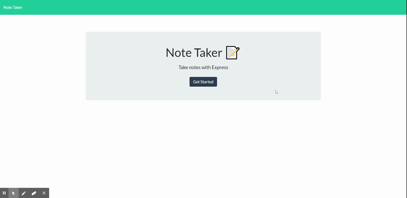

  
  # Note Taker

  ## Description

  For this week's assignment I created an application that allows the user to create, save, and delete notes. The application does save the notes even after exiting it, the notes need to be deleted in order to be removed from the database. Express node was used on the backend to save and retrieve the notes which were stored in a JSON file.

  ## Table of Contents

  - [Installation](#installation)
  - [Usage](#usage)
  - [Credits](#credits)
  - [License](#license)
  - [Contributions](#contributions)
  - [Tests](#tests)
  - [Questions](#questions)

  ## Installation

  Follow the heroku link or Download the files, run npm i, and use node server.js

  ## Usage

  Take notes and save it to the backedn-server
  

  ## Credits

  

  ## License

  This application is covered under the MIT license. Read more at [License: MIT](https://opensource.org/licenses/MIT)

  ## Contributions

  send me an email

  ## Tests

  

  ## Questions

  1. Where can I find your github so that I can view your other projects? https://github.com/bsmyth310

  2. What email address should I use to contact you regarding further opportunities or questions? smythbenb@gmail.com
